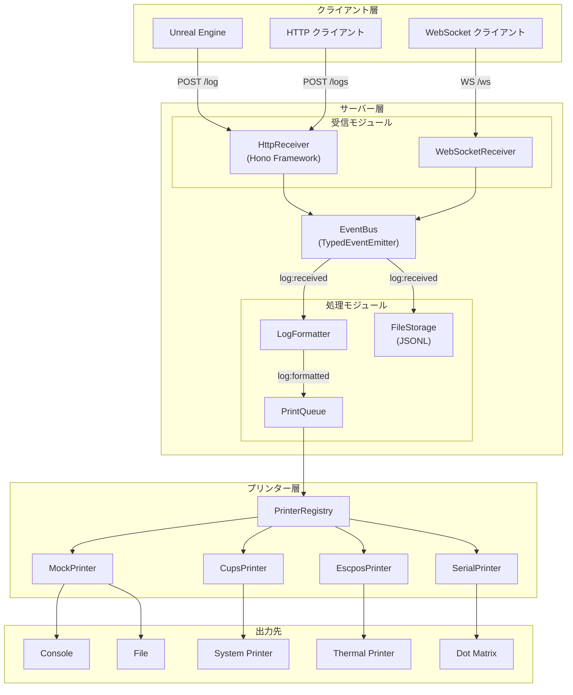
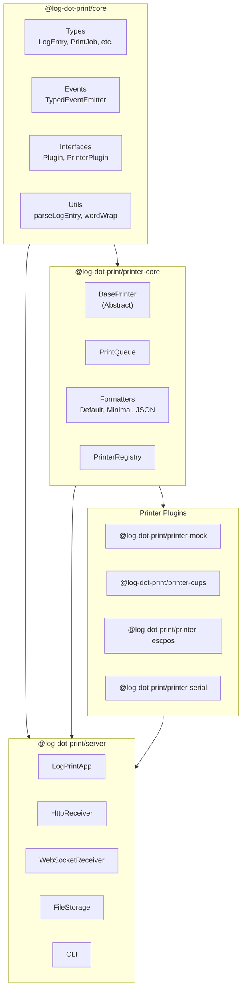
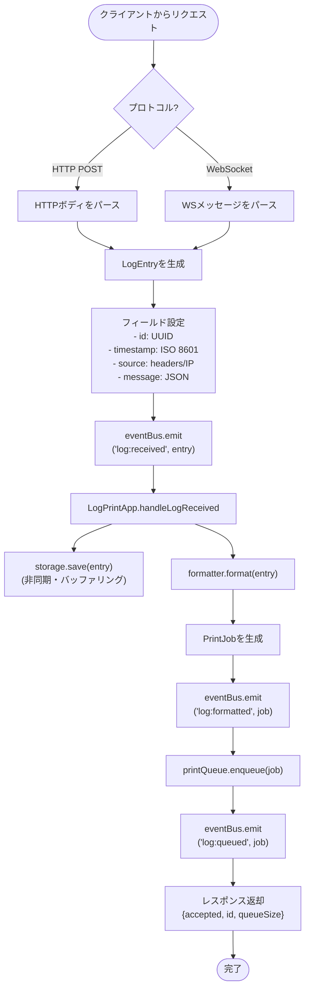
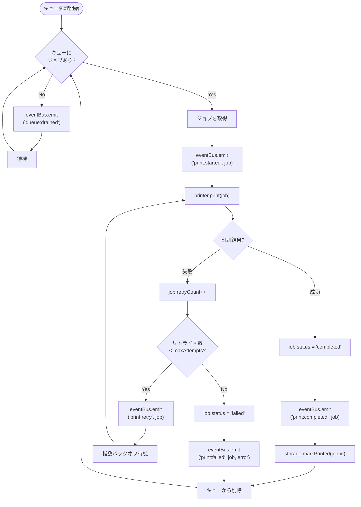
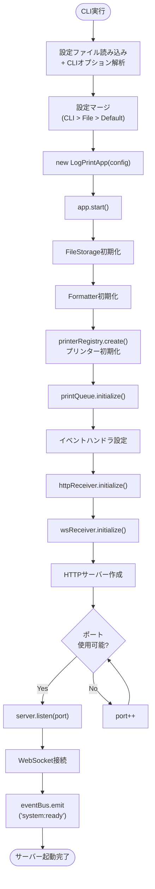
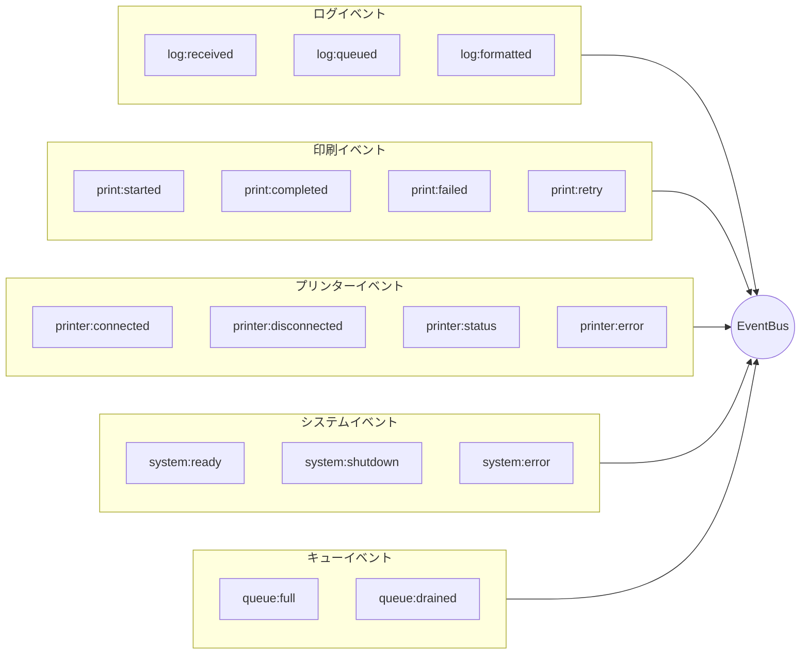
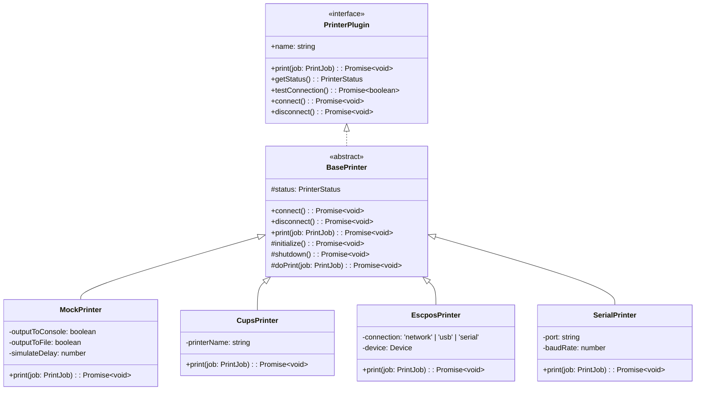
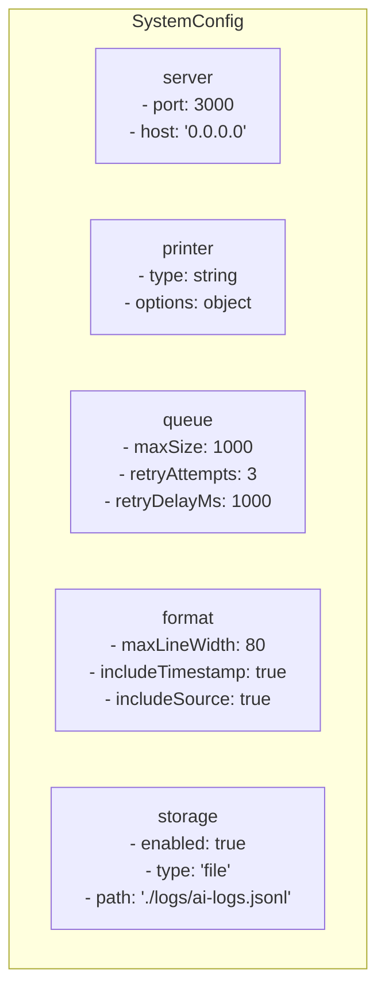

# Log-Dot-Print System Architecture

## 概要

Log-Dot-Print は、アートインスタレーション向けの **AI ログプリンターシステム** です。Unreal Engine（または任意の HTTP/WebSocket クライアント）からリアルタイムで AI ログを受信し、各種プリンターで印刷します。

## システム全体図



## コンポーネント構成



## ログ受信フロー



## 印刷処理フロー



## サーバー起動フロー



## イベントシステム



## プリンタープラグインアーキテクチャ



## 設定構造



## デザインパターン

| パターン | 適用箇所 | 説明 |
|---------|---------|------|
| Plugin Architecture | PrinterRegistry | プリンタープラグインの動的登録・生成 |
| Template Method | BasePrinter | プリンターのライフサイクル管理 |
| Event Emitter | TypedEventEmitter | コンポーネント間の疎結合通信 |
| Singleton | printerRegistry, eventBus | グローバルインスタンス管理 |
| Factory | PrinterRegistry.create() | プリンターの型別生成 |
| Strategy | Formatters | 出力形式の切り替え |
| Command | PrintJob | 印刷操作のカプセル化 |
| Observer | Event listeners | 状態変更への反応 |

## モノレポ構成

```
packages/
├── core/                 # 型、イベント、インターフェース（プラットフォーム非依存）
├── printer-core/         # キュー、フォーマッター、ベースプリンター、レジストリ
├── printer-mock/         # Mockプリンタープラグイン
├── printer-cups/         # CUPSプリンタープラグイン
├── printer-escpos/       # ESC/POSプリンタープラグイン
├── printer-serial/       # シリアルプリンタープラグイン
└── server/               # HTTP/WSサーバー、CLI、ストレージ、アプリオーケストレーション
```

## APIエンドポイント

| メソッド | パス | 説明 |
|---------|------|------|
| POST | `/log` | 単一ログエントリの送信 |
| POST | `/logs` | バッチログエントリの送信 |
| GET | `/health` | ヘルスチェック |
| WS | `/ws` | WebSocketリアルタイム接続 |

## 主要な実装詳細

- **非同期/Await**: すべてのI/O操作は非同期ファースト
- **型安全性**: 完全なTypeScriptとジェネリック型付け
- **エラーハンドリング**: try-catch + イベント発行
- **リトライロジック**: 指数バックオフ（遅延をリトライ回数で乗算）
- **書き込みバッファリング**: FileStorageはパフォーマンスのためバッチ書き込み
- **ポートフォールバック**: 設定ポートが使用中の場合自動インクリメント
- **CORS**: クロスオリジンリクエスト有効
- **OpenAPI**: HTTPエンドポイントのドキュメント化
- **Graceful Shutdown**: SIGINT/SIGTERMハンドラがキューをドレインしてから終了
